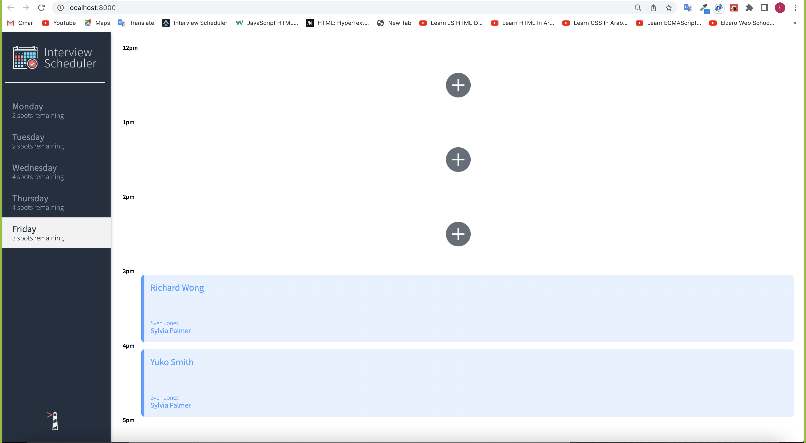
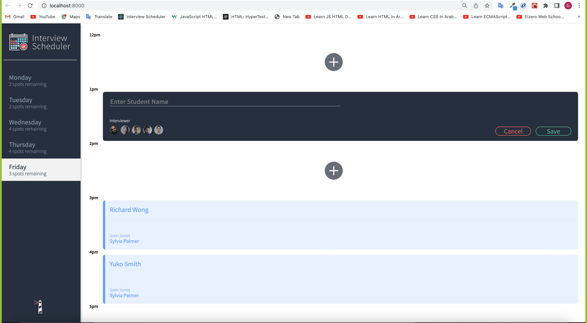
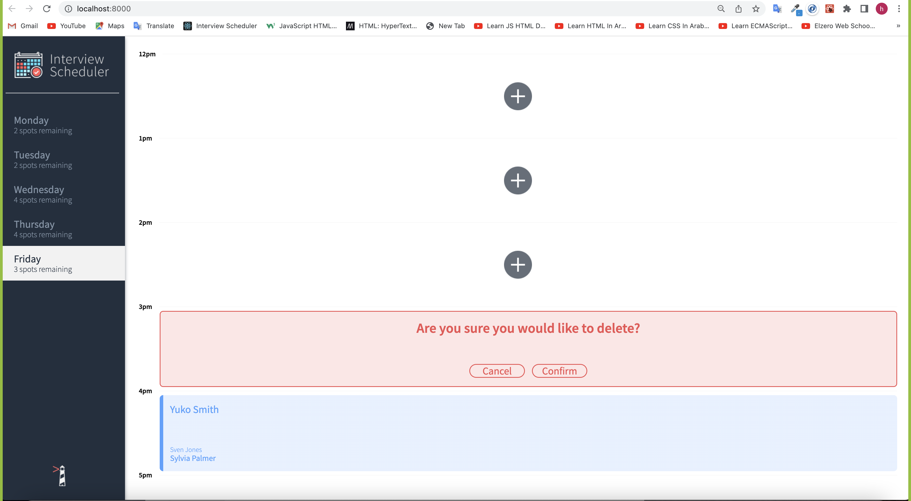

# Interview Scheduler

## Description

A React application that allows users to book and cancel interviews. Data is persisted by the API server using a PostgreSQL database, jest tests are used through the development of the project. The client application communicates with a WebSocket server, when a user books or cancels an interview, all connected users see the update in their browser.

## Final Product







## Dependencies

- axios
- Express
- react
- react-dom
- react-scripts
- normalize.css
- classnames

## Setup

Install dependencies with `npm install`.

## Running Webpack Development Server

```sh
npm start
```

## Running Jest Test Framework

```sh
npm test
```

## Running Storybook Visual Testbed

```sh
npm run storybook
```
